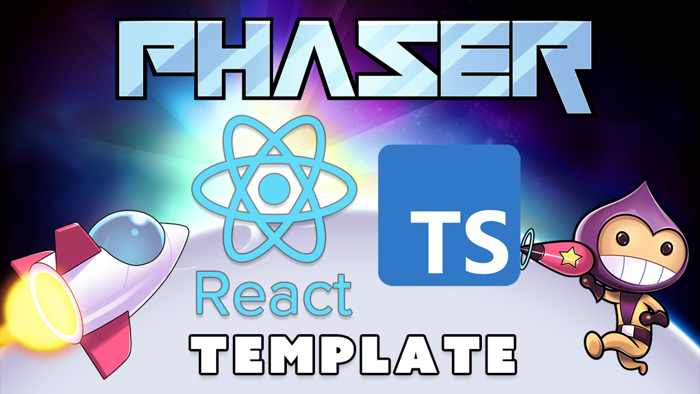

# Phaser Editor React TypeScript Template

This is a Phaser Editor v4 project template that uses React TypeScript for bundling. It supports hot-reloading for quick development workflow and includes scripts to generate production-ready builds.

### Versions

This template has been updated for:

- [Phaser 3.88.2](https://github.com/phaserjs/phaser)
- Phaser Editor v4.0 and above



## What is Phaser Editor?

Phaser Editor enables you to visually create Phaser games. Instead of entering numbers in your code to position Game Objects, you can drag and drop them into place, tweak their animations, adjust their physics bodies, enable special effects, and more. It's quicker and faster for both artists and developers alike and publishes pure Phaser code.

See more at [phaser.io](https://phaser.io/editor)

## Requirements

[Node.js](https://nodejs.org) is required to install dependencies and run scripts via `npm`.

An active subscription to Phaser Editor is required to load and use this template within it.

## Available Commands

| Command         | Description                                    |
| --------------- | ---------------------------------------------- |
| `npm install`   | Install project dependencies                   |
| `npm run dev`   | Launch a development web server                |
| `npm run build` | Create a production build in the `dist` folder |

## Writing Code

After cloning the repo, run `npm install` from your project directory.

To start the local development server use `npm run dev`.

## Deploying to Production

To create a production build use the command `npm run build`.

This will take your game code and build it into a single bundle, ready for deployment. This bundle is saved to the `dist` folder. Please note that some templates save to the `build` folder instead. The deployment script will also copy any assets your project imported, or stored in the public assets folder.

To deploy your game, upload _all_ of the contents of the `dist` folder to a public-facing web server.

**Note:** In some templates, the `dist` folder has been renamed to `build` to remain within that framework's conventions.

## CI/CD: GitHub Actions → AWS S3

This repo includes a workflow at `.github/workflows/deploy.yml` that builds and deploys to an S3 bucket using GitHub OIDC (no long‑lived AWS keys).

### 1) Create an S3 bucket

- Example: `james-games-site` in your chosen region.
- You can enable S3 Static Website Hosting, or (recommended) put CloudFront in front of the bucket for HTTPS and caching.

### 2) Create an IAM Role for GitHub OIDC

Create a role in IAM with a trust policy for GitHub’s OIDC provider:

Trust policy (replace `<ACCOUNT_ID>` and repo path if you fork):

```json
{
  "Version": "2012-10-17",
  "Statement": [
    {
      "Effect": "Allow",
      "Principal": {
        "Federated": "arn:aws:iam::<ACCOUNT_ID>:oidc-provider/token.actions.githubusercontent.com"
      },
      "Action": "sts:AssumeRoleWithWebIdentity",
      "Condition": {
        "StringEquals": { "token.actions.githubusercontent.com:aud": "sts.amazonaws.com" },
        "StringLike": {
          "token.actions.githubusercontent.com:sub": [
            "repo:jamesevans28/james-games:ref:refs/heads/main",
            "repo:jamesevans28/james-games:environment:*"
          ]
        }
      }
    }
  ]
}
```

Attach an inline permissions policy restricted to your bucket (and optional CloudFront invalidation):

```json
{
  "Version": "2012-10-17",
  "Statement": [
    {
      "Sid": "BucketList",
      "Effect": "Allow",
      "Action": ["s3:ListBucket"],
      "Resource": "arn:aws:s3:::james-games-site"
    },
    {
      "Sid": "BucketWrite",
      "Effect": "Allow",
      "Action": ["s3:PutObject", "s3:DeleteObject", "s3:PutObjectAcl"],
      "Resource": "arn:aws:s3:::james-games-site/*"
    },
    {
      "Sid": "InvalidateCloudFront",
      "Effect": "Allow",
      "Action": ["cloudfront:CreateInvalidation"],
      "Resource": "*"
    }
  ]
}
```

Record the Role ARN, e.g. `arn:aws:iam::<ACCOUNT_ID>:role/github-oidc-james-games`.

### 3) Configure GitHub Secrets / Variables

In GitHub → Settings → Secrets and variables → Actions:

- Secrets
  - `AWS_ROLE_TO_ASSUME` = your IAM Role ARN
- Variables (or Secrets)
  - `AWS_REGION` = e.g. `us-east-1`
  - `S3_BUCKET` = e.g. `james-games-site`
  - `CLOUDFRONT_DISTRIBUTION_ID` = optional distribution id

### 4) Deploy

Push to `main` or run the workflow manually. The workflow will:

- Install dependencies and build with Vite (`npm run build-nolog`)
- `aws s3 sync dist/ s3://$S3_BUCKET --delete`
- Re-upload `index.html` with `Cache-Control: no-store` to avoid stale HTML
- Optionally create a CloudFront invalidation

## Phaser Editor considerations

### Excluding files from the project

You don't want to add every file in this template to your Phaser Editor project. For example, the whole of `node_modules` can be excluded.

The `/.skip` file lists the folders and files to exclude from the editor's project.

[Learn more about resource filtering in Phaser Editor](https://phaser.io/editor/docs/misc/resources-filtering)

### Asset Pack

Phaser has the ability to load what are known as 'asset packs'. These are JSON files that describe all of the content that your game needs to load, such as images, audio, and fonts. Phaser Editor will generate and use asset packs intensively and tools such as the Scene Editor depend upon the information stored in the asset pack files.

You can have multiple asset packs per project, which is the recommended practice for larger games, allowing you to load only the pack of assets the game requires at that specific point.

In this template, we have pre-configured two types of asset packs: `boot-asset-pack.json` and `preload-asset-pack.json`.

The `boot-asset-pack.json` file is used to load assets when the game first boots. Typically, you would store a small selection of initial assets in here, such as a loading screen image and progress bar.

The `preload-asset-pack.json` in this template contains the rest of the assets the game needs. You are free to create additional packs as required, but for the sake of simplicity, this template has been configured with just these two packs.

[Learn more about Asset Pack loading in Phaser](https://newdocs.phaser.io/docs/3.80.0/Phaser.Loader.LoaderPlugin#pack)

## Join the Phaser Community!

We love to see what developers like you create with Phaser! It really motivates us to keep improving. So please join our community and show off your work 😄

**Visit:** The [Phaser website](https://phaser.io) and follow on [Phaser Twitter](https://twitter.com/phaser_)<br />
**Play:** Some of the amazing games [#madewithphaser](https://twitter.com/search?q=%23madewithphaser&src=typed_query&f=live)<br />
**Learn:** [API Docs](https://newdocs.phaser.io), [Support Forum](https://phaser.discourse.group/) and [StackOverflow](https://stackoverflow.com/questions/tagged/phaser-framework)<br />
**Discord:** Join us on [Discord](https://discord.gg/phaser)<br />
**Code:** 2000+ [Examples](https://labs.phaser.io)<br />
**Read:** The [Phaser World](https://phaser.io/community/newsletter) Newsletter<br />

Created by [Phaser Studio](mailto:support@phaser.io). Powered by coffee, anime, pixels and love.

The Phaser logo and characters are &copy; 2011 - 2025 Phaser Studio Inc.

All rights reserved.
